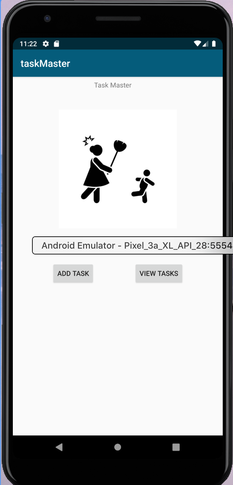
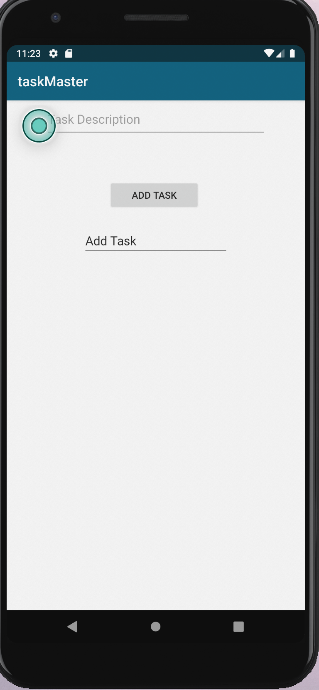
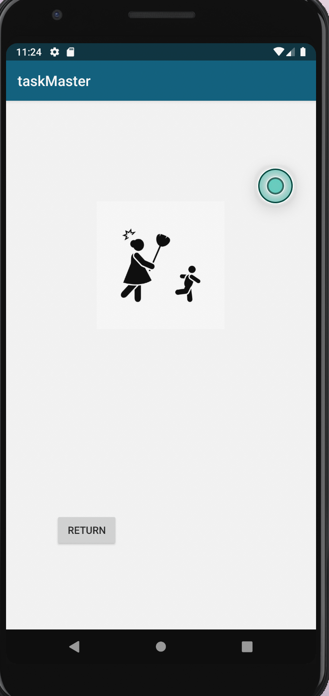
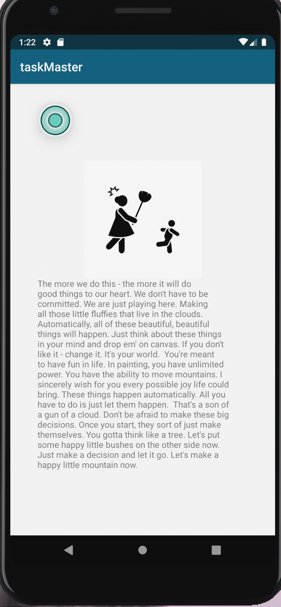
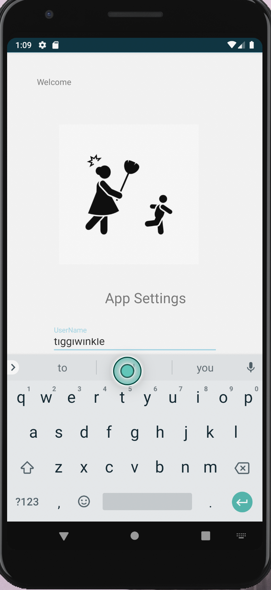
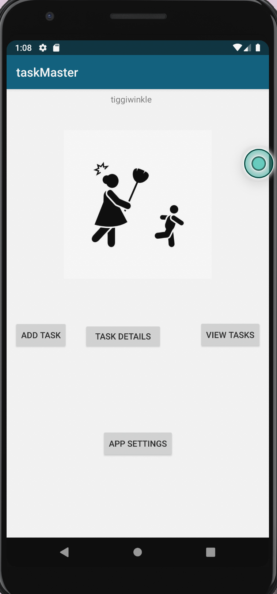
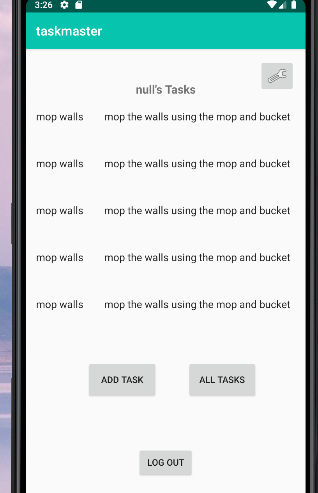
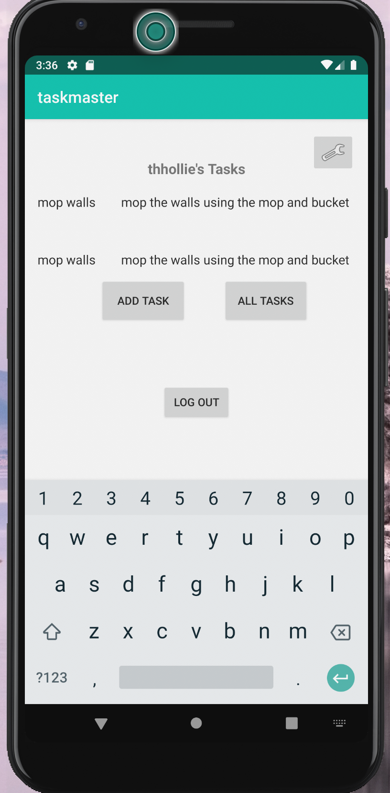
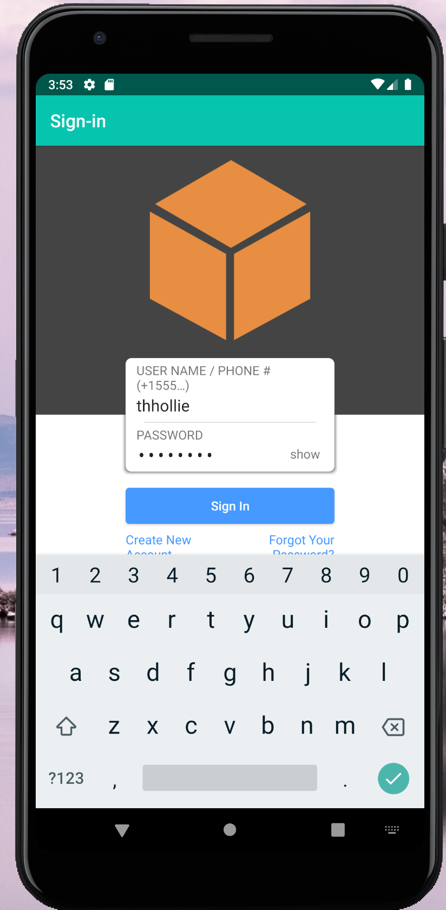
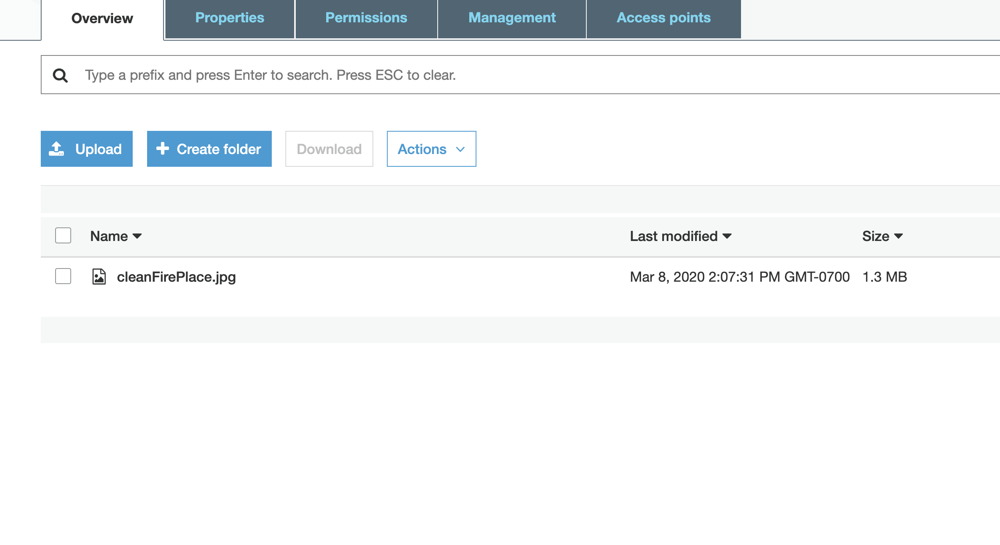

# Task Master

## Lab One

**Homepage**
The main page should be built out to match the wireframe. In particular, it should have a heading at the top of the page, an image to mock the "my tasks" view, and buttons at the bottom of the page to allow going to the "add tasks" and "all tasks" page.

**Add a Task**

On the "Add a Task" page, allow users to type in details about a new task, specifically a title and a body. When users click the "submit" button, show a "submitted!" label on the page.

**View Tasks**

The all tasks page should just be an image with a back button.

## Lab Two Feature Tasks

**Task Detail Page**
Create a Task Detail page. It should have a title at the top of the page, and a Lorem Ipsum description.

**Settings Page**
Create a Settings page. It should allow users to enter their username and hit save.

**Homepage**
The main page should be modified to contain three different buttons with hardcoded task titles. When a user taps one of the titles, it should go to the Task Detail page, and the title at the top of the page should match the task title that was tapped on the previous page.

The homepage should also contain a button to visit the Settings page, and once the user has entered their username, it should display “{username}’s tasks” above the three task buttons.

## Lab Three Feature Tasks (recycler view) 

**Task Detail Page**
Create a ViewAdapter class that displays data from a list of Tasks.
In your MainActivity, create at least three hardcoded Task instances and use those to populate your RecyclerView/ViewAdapter.

## Lab Four Feature Tasks (Room) 

**Task Model and Room**
Following the directions provided in the Android documentation, set up Room in your application, and modify your Task class to be an Entity.

## Lab Five Feature Tasks (Intent Filter) 

**Adding a Task from another application**
Add an intent filter to your application such that a user can hit the “share” button on an image in another application, choose TaskMaster as the app to share that image with, and be taken directly to the Add a Task activity with that image pre-selected

## Lab Six Feature Tasks (Cognito) 

**add Log in**
Add Cognito to your Amplify setup. Add in user login and sign up flows to your application, using Cognito’s pre-built UI as appropriate. Display the logged in user’s username somewhere relevant in your app.

## Lab 8 Feature Tasks (S3) 

**S3**
On the “Add a Task” activity, allow users to optionally select a file to attach to that task. If a user attaches a file to a task, that file should be uploaded to S3, and associated with that task.

